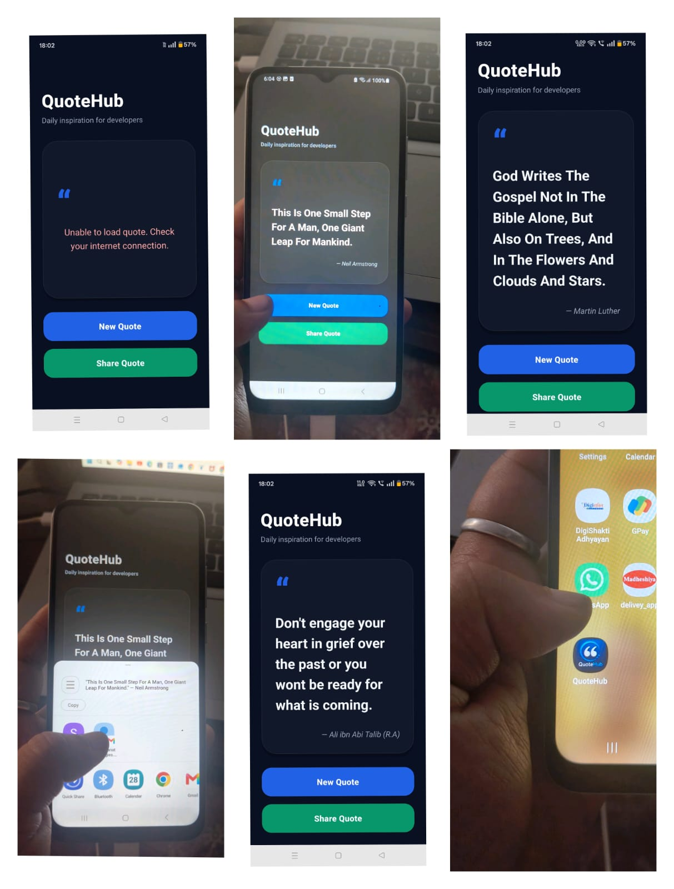

# QuoteHub 📱

A modern React Native quotes app built with **React Native CLI**. The app fetches random inspirational quotes from an API and displays them in a clean dark-themed interface.

---

## ✨ Features

- 🔄 Random quote generation
- ⚡ Real-time API integration
- ⏳ Loading indicator
- ❌ Error handling for network issues
- 📤 Share quotes with other apps
- 🌙 Modern dark UI
- 🎨 Custom app icon
- 📦 Release APK generated

---

## 📸 Screenshots



---

## 🛠 Tech Stack

- React Native CLI
- JavaScript
- React Hooks (`useState`, `useEffect`)
- Fetch API
- Async/Await

---

## 🚀 Getting Started

### Clone the repository

```bash
git clone https://github.com/kirti-pandey-coder/QuoteHub.git
cd QuoteHub
```

### Install dependencies

```bash
npm install
```

### Run on Android

```bash
npx react-native run-android
```

### Start Metro

```bash
npm start
```

---

## 📦 Release APK

The release APK can be found in:

```bash
android/app/build/outputs/apk/release/
```

---

## 📂 Project Structure

```bash
src/
├── assets/
├── screenshots/
└── components/

App.jsx
README.md
```

---

## 👩‍💻 Author

**Kirti Pandey**

- GitHub: https://github.com/kirti-pandey-coder

---

## ⭐ Support

If you like this project, give it a **star ⭐ on GitHub**.
